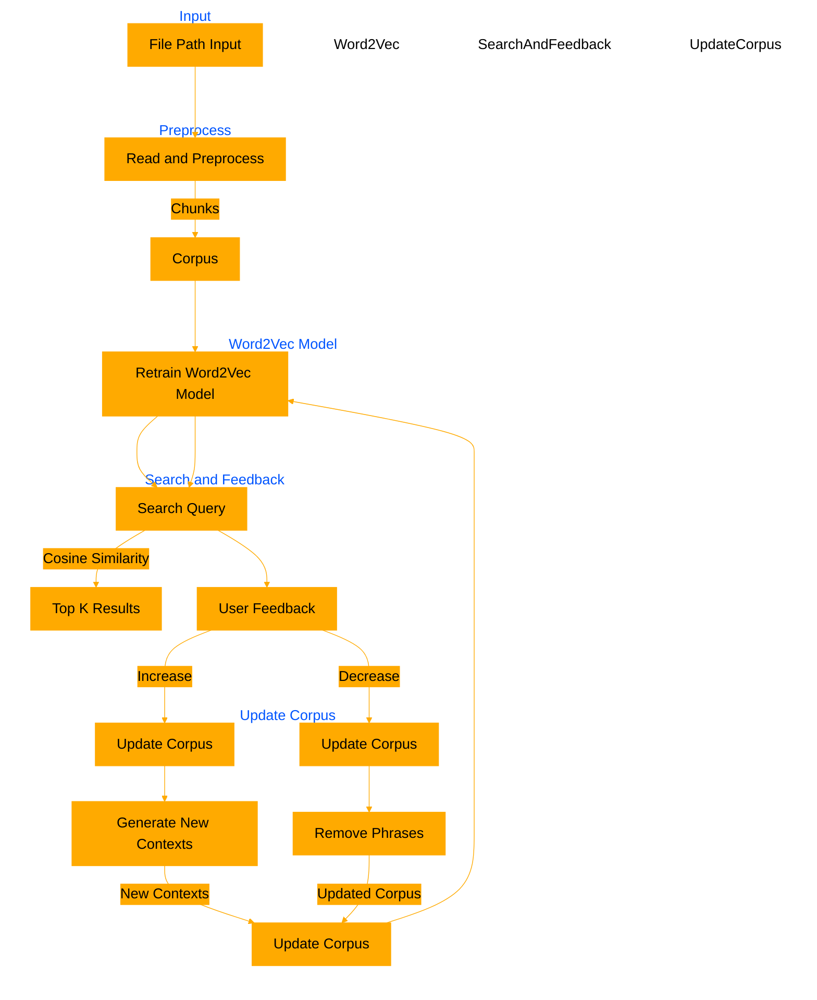

# thought2VEC
```
\\|||||||||||||||||||//
||||||||||||||||||||||
Fear's algorithms, 
shadows,
process text, 
in darkest light.

thought2VEC forms, 
a corpus,
CHUNK and split, 
the words align,
Word2Vec, 
connections bind.

Cosine measures, 
similarity’s query seeks, 
from life to death.

Feedback flows increase decrease corpus shifts, 
adjusts, 
finds peace,
context grows,
phrases bloom, 
as shadow sows.

In the dark,
fear and code, 
merge in night.

||| end - enter |||
```

Current human in the loop implementation. WIP is semantic matching responses to guidance corpus for auto pruning/generation for a dynamic "memory" corpus. 



